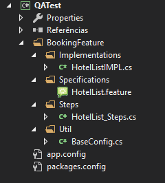

# Kneat QA Automation Test
> This project includes the flow of hotels reservation on Booking.com

# Project dependencies
> This project was built with:
   * [Selenium](https://www.selenium.dev/)
   * [Cucumber](https://cucumber.io/)
   * MsTest
   

# Project Structure



> Explaining the structure:
  * **Implementations:** 
      - contain the _HoteListIMPL.cs_ file, that implements all methods for the test.
  * **Specifications:**
      - contain the _HotelList.feature_ file that implements the BDD Structure (Cucumber) for the test.
  * **Steps:**
      - contain the _HotelList_Steps.cs_ file that implements the Steps for the test.
  * **Util:**
      - contain the BaseConfig.cs_ file that implements all the browser setup for the test.

## Run Test
  * Install Visual Studio 2019 or higher [(download here)](https://docs.microsoft.com/pt-br/visualstudio/?view=vs-2019).
  * Download the project files
  * Open the Solution Project in Visual Studio then compile the solution to generate the _.dll_ file, as show bellow:
      * With the _Solution Explorer_ window open, right click over the solution project and click over _Build_ option, and wait for the build is completed message, as follow:
      
      
      
      
      
      * After the build is completed

  
  
  * After compile the solution, open the test 


## Usage example

A few motivating and useful examples of how your product can be used. Spice this up with code blocks and potentially more screenshots.

_For more examples and usage, please refer to the [Wiki][wiki]._

## Development setup

Describe how to install all development dependencies and how to run an automated test-suite of some kind. Potentially do this for multiple platforms.

```sh
make install
npm test
```

## Release History

* 0.2.1
    * CHANGE: Update docs (module code remains unchanged)
* 0.2.0
    * CHANGE: Remove `setDefaultXYZ()`
    * ADD: Add `init()`
* 0.1.1
    * FIX: Crash when calling `baz()` (Thanks @GenerousContributorName!)
* 0.1.0
    * The first proper release
    * CHANGE: Rename `foo()` to `bar()`
* 0.0.1
    * Work in progress

## Meta

Your Name – [@YourTwitter](https://twitter.com/dbader_org) – YourEmail@example.com

Distributed under the XYZ license. See ``LICENSE`` for more information.

[https://github.com/yourname/github-link](https://github.com/dbader/)

## Contributing

1. Fork it (<https://github.com/yourname/yourproject/fork>)
2. Create your feature branch (`git checkout -b feature/fooBar`)
3. Commit your changes (`git commit -am 'Add some fooBar'`)
4. Push to the branch (`git push origin feature/fooBar`)
5. Create a new Pull Request

<!-- Markdown link & img dfn's -->
[npm-image]: https://img.shields.io/npm/v/datadog-metrics.svg?style=flat-square
[npm-url]: https://npmjs.org/package/datadog-metrics
[npm-downloads]: https://img.shields.io/npm/dm/datadog-metrics.svg?style=flat-square
[travis-image]: https://img.shields.io/travis/dbader/node-datadog-metrics/master.svg?style=flat-square
[travis-url]: https://travis-ci.org/dbader/node-datadog-metrics
[wiki]: https://github.com/yourname/yourproject/wiki
