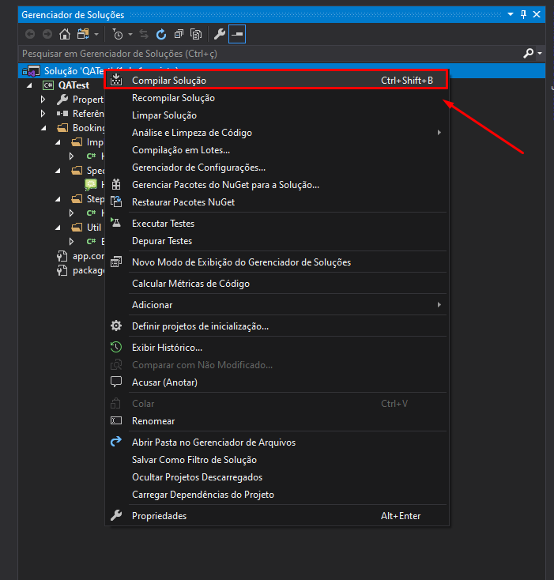
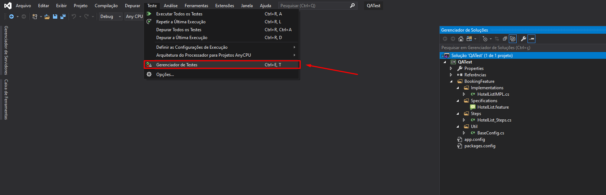
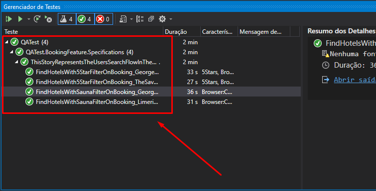

# Kneat QA Automation Test
> This project includes the flow of hotels reservation on Booking.com

# Project dependencies
> This project was built with:
   * [Selenium](https://www.selenium.dev/)
   * [Cucumber](https://cucumber.io/)
   * MsTest
   

# Project Structure

> Explaining the structure:
  * **Implementations:** 
      - contain the _HoteListIMPL.cs_ file, that implements all methods for the test.
  * **Specifications:**
      - contain the _HotelList.feature_ file that implements the BDD Structure (Cucumber) for the test.
  * **Steps:**
      - contain the _HotelList_Steps.cs_ file that implements the Steps for the test.
  * **Util:**
      - contain the BaseConfig.cs_ file that implements all the browser setup for the test.

## Run Test
  * Install Visual Studio 2019 or higher [(download here)](https://docs.microsoft.com/pt-br/visualstudio/?view=vs-2019).
  * Download the project files
  * Open the Solution Project in Visual Studio then compile the solution to generate the _.dll_ file, as show follow:
      * With the _Solution Explorer_ window open, right click over the solution project and click over _Build_ option, and wait for the build is completed message:
 

    * After the build is completed, open the _Test Explrer_ window ( go to Teste > Windows > Test Explorer) and click _Run All_. Then all scenarios tests should be executed. 

* When the execution is finished and green icons are visible, the tests were run successfully 

  

